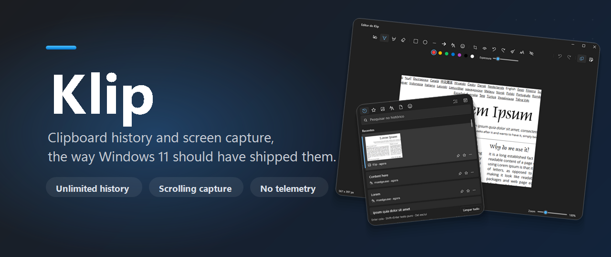

<div align="center">




# Klip

**Histórico de clipboard e captura de tela para o Windows 11, sem os limites do nativo.**

[](https://github.com/PoBruno/klip/actions/workflows/ci.yml)
[](https://github.com/PoBruno/klip/releases/latest)
[](LICENSE)
[](#)

### Instalar

```powershell
winget install pobruno.Klip
```

ou **[baixe o instalador](https://github.com/PoBruno/klip/releases/latest)** (ou o exe portátil) na última release.

[Instalar](https://github.com/PoBruno/klip/releases/latest) - [Recursos](#recursos) - [Compilar](#compilar-do-código-fonte)

</div>

---

## O que é o Klip

O painel Win+V e a Ferramenta de Captura nativos são bonitos, mas te seguram: o histórico de clipboard é curto e sem busca de verdade, e o editor de captura não tem metade das ferramentas que você quer.

O Klip mantém essa mesma cara e jeito nativo, e tira os limites. Duas coisas, bem feitas:

- **Histórico de clipboard** como o Win+V, mas ilimitado, com busca de verdade, filtro por data, favoritos, abas e um seletor de emoji colorido.
- **Captura de tela** como o Win+Shift+S, mais captura com rolagem, gravação de tela em GIF/MP4 e um editor de verdade.

App WPF nativo, Fluent Design e Mica, mora na bandeja. Sem Electron, sem navegador, sem telemetria. Pode assumir os atalhos `Win+V` e `Win+Shift+S` se você deixar.

## Recursos

**Histórico de clipboard**
- Ilimitado, guardado em SQLite local com busca full text.
- Busca enquanto digita, filtro por data, favoritos, abas por tipo.
- Mantém a formatação HTML/RTF, ou cola como texto puro.
- Seletor de emoji e símbolos colorido, buscável em vários idiomas.
- Detector de segredos embutido pra tokens e senhas não ficarem largados.

**Captura de tela**
- Cópia fiel do overlay do Win+Shift+S.
- Modos: retângulo, janela, tela cheia, forma livre.
- Captura com rolagem pra pegar uma página inteira que não cabe na tela.
- Segure Ctrl ao selecionar pra abrir a captura direto no editor.
- Ciente de múltiplos monitores, geometria em pixels físicos.

**Gravação de tela**
- Grave qualquer região em MP4 (H.264 + AAC, encoder de hardware com tuning pra conteúdo de tela) com som do sistema e microfones, ou direto em GIF com encoder próprio.
- Control hub flutuante durante a gravação: arraste pra onde quiser (qualquer monitor), pause/retome, mute do mic ou do som do sistema, mostrar/ocultar o cursor e a borda da região, tudo ao vivo.
- MP4 fragmentado à prova de crash: mesmo se o app morrer, o que foi gravado continua reproduzível.

**Editor de mídia**
- Edição em timeline pras gravações: dividir, aparar, reordenar e afastar segmentos (espaços viram preto), com desfazer/refazer.
- Ferramentas de GIF: reduzir fps, redimensionar, scrub frame a frame; exportar MP4 pra GIF.
- Exporta pelo encoder GIF embutido ou via `ffmpeg` quando disponível.

**Editor**
- Caneta, marca-texto, formas, seta, texto livre, recorte, girar.
- Desfocar/tapar, mais tapar automático de emails/telefones/cartões via OCR local.
- Remover fundo, desfazer/refazer, cópia automática a cada edição.

**Sistema**
- Takeover opcional do `Win+V` e do `Win+Shift+S`, revertido direitinho na desinstalação.
- Instância única, inicia com o Windows (opcional), importa/exporta o histórico como `.zip`.

## Compilar do código fonte

Você precisa do **SDK do .NET 9** e do Windows 11.

```powershell
git clone https://github.com/PoBruno/klip.git
cd klip

dotnet build Klip.sln            # compila
dotnet test Klip.sln             # roda os testes (xunit)
dotnet run --project src/Klip.App   # roda o app (aparece na bandeja)
```

Empacotamento:

```powershell
.\tools\build-exe.ps1          # exe único self contained -> publish\Klip.exe
.\tools\build-installer.ps1    # instalador Inno Setup -> dist\Klip-Setup-<versao>.exe
```

O script do instalador precisa do [Inno Setup 6](https://jrsoftware.org/isdl.php). O Klip não é distribuído como MSIX de propósito: o sandbox bloqueia o takeover de atalhos e o hook global de teclado de que ele depende.

## Tecnologia

- WPF no .NET 9 (`net9.0-windows`), C# 13, MVVM.
- Separação limpa: `Klip.Core` (domínio puro), `Klip.Interop` (P/Invoke Win32), `Klip.App` (WPF).
- SQLite com FTS5 pro histórico e a busca.

## Contribuindo

Issues e pull requests são bem vindos. Vai fazer algo maior? Abre uma issue antes pra gente conversar.

## Créditos

- O stitching da captura com rolagem é inspirado no [ShareX](https://github.com/ShareX/ShareX) (só a ideia, sem reaproveitar código).
- Emojis do [Twemoji](https://github.com/jdecked/twemoji), [CC-BY 4.0](https://creativecommons.org/licenses/by/4.0/). Nomes dos emojis do [Unicode CLDR](https://cldr.unicode.org/).

## Política de assinatura de código

Assinatura de código gratuita provida pelo [SignPath.io](https://signpath.io), certificado do [SignPath Foundation](https://signpath.org).

- Committer, revisor e aprovador: [PoBruno](https://github.com/PoBruno)

Privacidade: o Klip roda 100% na sua máquina e não transfere nenhuma informação pra outros sistemas em rede a não ser quando você pedir. Sem telemetria.

## Licença

O Klip é distribuído sob a [GNU GPLv3](LICENSE).
